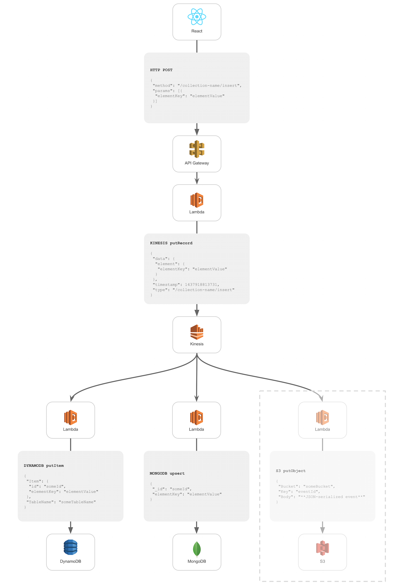

[](https://travis-ci.org/innowatio/lk-collection)
[](https://coveralls.io/github/innowatio/lk-collection?branch=master)
[](https://david-dm.org/innowatio/lk-collection)
[](https://david-dm.org/innowatio/lk-collection#info=devDependencies)

#lk-collection

Implement collections in an lk stack (Lambda, Kinesis).

## How it works

The library allows creating a collection object which has attached three (for
now) lambda functions:

- `apiGatewayToKinesis`: TODO

- `kinesisToMongodb`: takes kinesis events and projects them into a mongodb
  collection




API Gateway event format:

```js
{
    "method": "POST",
    "body": "whatever",
    "token": "authToken"
}
```


## Application event format

```json
    {
        "id": "f47ac10b-58cc-4372-a567-0e02b2c3d479",
        "data": {},
        "timestamp": 1437918813731,
        "type": "event-type"
    }
```

The `data` property can be any JSON document.

## Collection events

### Insert

**JSON Rpc (coming, for instance, from an API Gateway request)**:

```json
    {
        "method": "/collection-name/insert",
        "params": [{
            "elementKey": "elementValue"
        }]
    }
```

**Resulting event sent to kinesis**:

```json
    {
        "data": {
            "element": {
                "elementKey": "elementValue"
            }
        },
        "timestamp": 1437918813731,
        "type": "element inserted in collection collection-name"
    }
```

**Resulting document inserted into dynamodb / mongodb**

Dynamodb:
```json
{
    "id": "someId",
    "elementKey": "elementValue"
}
```

Mongodb:
```json
{
    "_id": "someId",
    "elementKey": "elementValue"
}
```

### Remove

**JSON Rpc (coming, for instance, from an API Gateway request)**:

```json
    {
        "method": "/collection-name/remove",
        "params": ["elementId"]
    }
```

**Resulting event sent to kinesis**:

```json
    {
        "data": {
            "id": "elementId"
        },
        "timestamp": 1437918813731,
        "type": "element removed in collection collection-name"
    }
```

**Resuling operation performed in dynamodb / mongodb**

Dynamodb: removal of document with `document.id === elementId`.
Mongodb: removal of document with `document._id === elementId`.

### Replace

**JSON Rpc (coming, for instance, from an API Gateway request)**:

```json
    {
        "method": "/collection-name/replace",
        "params": ["elementId", {
            "replacedKey": "replacedValue"
        }]
    }
```

**Resulting event sent to kinesis**:

```json
    {
        "data": {
            "id": "elementId",
            "element": {
                "replacedKey": "replacedValue"
            }
        },
        "timestamp": 1437918813731,
        "type": "element replaced in collection collection-name"
    }
```

**Resulting document inserted into dynamodb / mongodb (replaces the existing one)**

Dynamodb:
```json
{
    "id": "someId",
    "replacedKey": "replacedValue"
}
```

Mongodb:
```json
{
    "_id": "someId",
    "replacedKey": "replacedValue"
}
```

## Example usage

```js
/* Lambda function invoked by API Gateway */
import Collection from "lk-collection";

var myCollection = new Collection({
    name: "myCollectionName"
    kinesisStreamName: "myStream"
});

export var handler = myCollection.jsonRpcToKinesis;
```

```js
/* Lambda function invoked by Kinesis */
import Collection from "lk-collection";

var myCollection = new Collection({
    name: "myCollectionName",
    dynamodbTableName: "myTable"
});

export var handler = myCollection.kinesisToDynamodb;
```

```js
/* Lambda function invoked by Kinesis */
import Collection from "lk-collection";

var myCollection = new Collection({
    name: "myCollectionName",
    mongodbUrl: "mongodb://mongo:27017/myDatabase",
    mongodbCollectionName: "myCollection"
});

export var handler = myCollection.kinesisToMongodb;
```

### RPC validation

It's possible to pass the constructor a `validateRpc` option, which must be a
function which either:

- returns a value
- throws
- returns a promise

The validation is considered successful (and therefore the rcp is performed) if:

- the `validateRpc` function returns a value
- the `validateRpc` function returns a promise which is eventually resolved

The validation is considered unsuccessful (and therefore the rcp is not
performed) if:

- the `validateRpc` function throws
- the `validateRpc` function returns a promise which is eventually rejected

If the error thrown / promise reject value is an instance of `ValidationError`
(`import {ValidationError} from "lk-collection"`), then that error is used as
error of the rpc. Otherwise a generic
`{code: 500, message: "Internal server error"}` is used.
