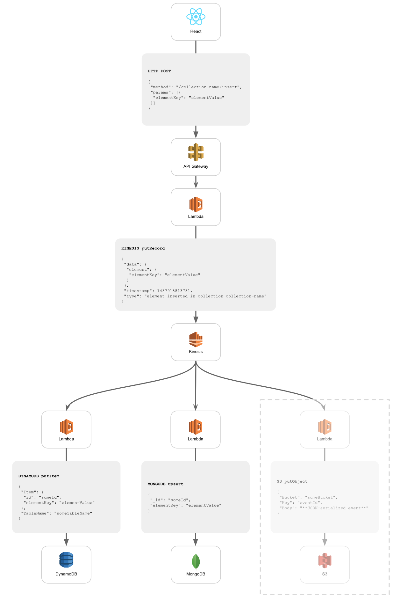

[](https://travis-ci.org/innowatio/lk-collection)
[](https://coveralls.io/github/innowatio/lk-collection?branch=master)
[](https://david-dm.org/innowatio/lk-collection)
[](https://david-dm.org/innowatio/lk-collection#info=devDependencies)

#lk-collection

Implement collections in an lk stack (Lambda, Kinesis + MongoDB).

TODO: transaction id
## How it works

The library allows creating a collection object which has attached two lambda
functions:

- `apiGatewayToKinesis`: takes a request from API Gateway and publishes an
  event to a Kinesis stream

- `kinesisToMongodb`: takes kinesis events and projects them into a mongodb
  collection



## Application event format

```json
    {
        "id": "f47ac10b-58cc-4372-a567-0e02b2c3d479",
        "data": {},
        "timestamp": 1437918813731,
        "type": "event-type"
    }
```

The `data` property can be any JSON document.

## Collection events

### Insert

**Client -> API Gateway**:
```
POST /collection-name HTTP/1.1
Host: api-gateway.amazon.com
Content-Type: application/json
X-Token: authToken

{
    "elementKey": "elementValue"
}
```
**API Gateway -> Lambda**:
```json
{
    "collection": "collection-name",
    "method": "insert",
    "element": {
        "elementKey": "elementValue"
    },
    "token": "authToken"
}
```
**Lambda -> Kinesis -> Lambda**:
```json
{
    "data": {
        "id": "generatedId",
        "element": {
            "elementKey": "elementValue"
        }
    },
    "timestamp": "1970-01-01T00:00:00.000Z",
    "type": "element inserted in collection collection-name"
}
```
**Lambda -> MongoDB**:
Inserted document:
```json
{
    "_id": "generatedId",
    "elementKey": "elementValue"
}
```

### Remove

**Client -> API Gateway**:
```
DELETE /collection-name/elementId HTTP/1.1
Host: api-gateway.amazon.com
X-Token: authToken
```
**API Gateway -> Lambda**:
```json
{
    "collection": "collection-name",
    "method": "remove",
    "elementId": "elementId",
    "token": "authToken"
}
```
**Lambda -> Kinesis -> Lambda**:
```json
{
    "data": {
        "id": "elementId"
    },
    "timestamp": "1970-01-01T00:00:00.000Z",
    "type": "element removed in collection collection-name"
}
```
**Lambda -> MongoDB**
Removed document:
```json
{
    "_id": "elementId"
}
```

### Replace

**Client -> API Gateway**:
```
PUT /collection-name/elementId HTTP/1.1
Host: api-gateway.amazon.com
Content-Type: application/json
X-Token: authToken

{
    "elementKey": "replacedValue"
}
```
**API Gateway -> Lambda**:
```json
{
    "collection": "collection-name",
    "method": "replace",
    "elementId": "elementId",
    "element": {
        "elementKey": "replacedValue"
    },
    "token": "authToken"
}
```
**Lambda -> Kinesis -> Lambda**:
```json
{
    "data": {
        "id": "elementId",
        "element": {
            "elementKey": "replacedValue"
        }
    },
    "timestamp": "1970-01-01T00:00:00.000Z",
    "type": "element replaced in collection collection-name"
}
```
**Lambda -> MongoDB**
Updated document:
```json
{
    "_id": "elementId",
    "elementKey": "replacedValue"
}
```

## Example usage

```js
/* Lambda function invoked by API Gateway */
import Collection, {RequestError} from "lk-collection";

const myCollection = new Collection({
    name: "myCollectionName",
    mongodbUrl: "mongodb://myMongoHost/myDb",
    schema: {
        $schema: "http://json-schema.org/draft-04/schema#",
        type: "object"
    },
    authorizeApiRequest: (request) => {
        if (Math.random() > 0.5) {
            throw new RequestError(400, "Message", "Details");
        }
    },
    kinesisStreamName: "myStream"
});

export const handler = myCollection.apiGatewayToKinesis;
```

```js
/* Lambda function invoked by Kinesis */
import Collection from "lk-collection";

const myCollection = new Collection({
    name: "myCollectionName",
    mongodbUrl: "mongodb://myMongoHost/myDb",
});

export const handler = myCollection.kinesisToMongodb;
```

### Authorization

It's possible to pass the constructor an `authorizeApiRequest` function which
either:

- returns a value
- throws
- returns a promise

The validation is considered successful (hence the request is handled) if:

- the `authorizeApiRequest` function returns a value
- the `authorizeApiRequest` function returns a promise which is eventually
  resolved

The validation is considered unsuccessful (hence the request is rejected) if:

- the `authorizeApiRequest` function throws
- the `authorizeApiRequest` function returns a promise which is eventually
  rejected

If the error thrown / promise reject value is an instance of `RequestError`
(`import {RequestError} from "lk-collection"`), then that error is used as
error of the request. Otherwise a generic
`{code: 500, message: "Internal server error"}` is used.
